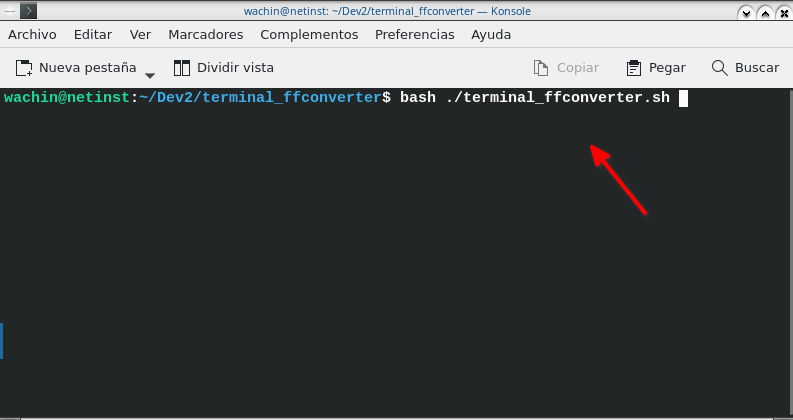
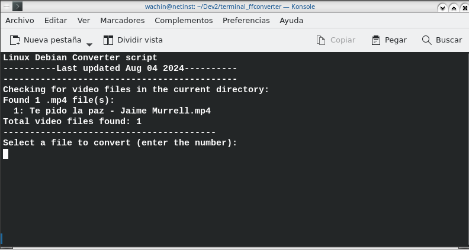
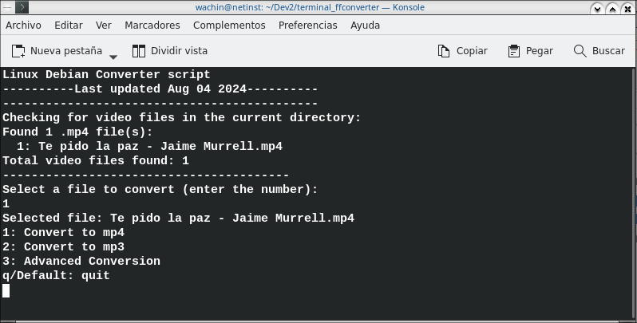

# Terminal FFmpeg Video Converter Script 
El script requiere: **ffmpeg, python**

## Probado en:

- Debian 12

# "Interfaz gráfica de Texto" para convertir videos con ffmpeg desde la terminal

Este scritp para uso desde la terminal requiere ffmpeg y bash

1. Abre una terminal.

2. Actualiza la lista de paquetes de tu sistema:

```
sudo apt update
```

Instala los paquetes:

```
sudo apt install ffmpeg bash
```

Después de instalar estos paquetes, deberías poder ejecutar el script sin problemas.

Para lanzar el programa ponga en una terminal en el lugar donde está el programa:

```
bash ./terminal_ffconverter.sh
```

 

aquí en la carpeta del proyecto he dejado el siguiente ejemplo a convertir:

Te pido la paz - Jaime Murrell.mp4

en la terminal aparecerá así:



como solo es un video de ejemplo aparece sólo este, y en el teclado aplasto la tecla "1" y doy Enter y sigue así:



allí elija el tipo de conversión que desea

**Nota:** Si elije la conversión avanzada debe escribir el tipo de archivo de salida que necesita

El resultado de su conversión estará en la carpeta:

ffmpeg_output

## Explicación del funcionamiento del script:

1. Definición del directorio del script:
   ```bash
   SCRIPT_DIR="$( cd "$( dirname "${BASH_SOURCE[0]}" )" && pwd )"
   ```
   Esta línea obtiene la ruta absoluta del directorio donde se encuentra el script.

2. Función `check_video_files()`:
   - Busca archivos de video en el directorio actual.
   - Muestra una lista numerada de los archivos encontrados.
   - Permite al usuario seleccionar un archivo para convertir.

3. Inicio del script principal:
   - Muestra el título y la fecha de actualización.
   - Llama a la función `check_video_files()`.

4. Menú principal:
   - Muestra las opciones de conversión (mp4, mp3, avanzada).
   - Lee la selección del usuario.

5. Preparación para la conversión:
   - Extrae el nombre del archivo sin la extensión.
   - Define el directorio de salida.
   - Crea el directorio de salida si no existe.

6. Proceso de conversión:
   - Opción 1 (Convertir a mp4):
     * Muestra opciones de calidad de video.
     * Ejecuta ffmpeg con los parámetros correspondientes a la calidad seleccionada.
   - Opción 2 (Convertir a mp3):
     * Muestra opciones de calidad de audio.
     * Ejecuta ffmpeg para convertir a mp3 con la calidad seleccionada.
   - Opción 3 (Conversión avanzada):
     * Permite al usuario especificar el formato de salida.
     * Ejecuta ffmpeg con el formato especificado.

7. Finalización:

   - Muestra un mensaje indicando que la conversión ha terminado y dónde se han guardado los archivos.
